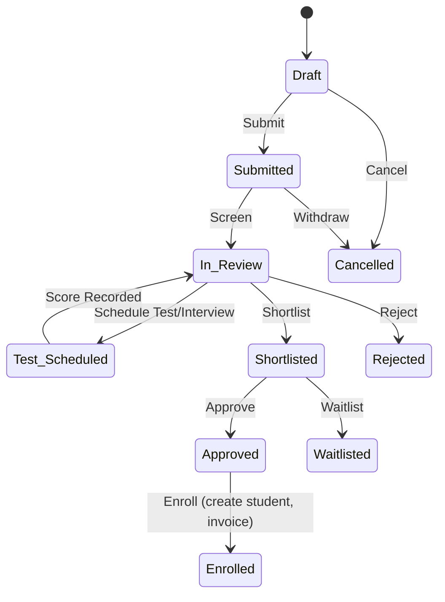

# 🎓 02_Admissions

**Module:** Admission Management  
**Purpose:** Provide a configurable, multi-institution, multi-campus, and multi-curriculum admission workflow that covers schools, colleges, universities, academies, vocational centers, and online programs.

---

## 🔑 Key Concepts

- **Applicant**: A person applying for admission (not yet a student).  
- **Program** (`edu.program`): What the institution teaches (e.g., *Grade 5 – Cambridge*, *B.Sc. CS*, *Diploma in Welding*). A program maps to a **standard** (schools) or a **course** (higher/vocational).  
- **Program Offering** (`edu.program.offer`): A campus + academic year–specific instance of a Program with capacity, fee plan, and curriculum details.  
- **Admission Intake** (`edu.admission.intake`): A dated application window (e.g., *Spring 2026*) within a Program Offering; can define tests, documents, and quotas.  
- **Application** (`edu.admission.application`): A candidate’s submission for an Intake (supports multi-preference if enabled).  
- **Enrollment**: Automatic creation/activation of `edu.student` on successful admission.

> This design ensures “admission for what **class/institute/curriculum**” is explicit via **Program → Program Offering → Intake**.

---

## ⚙️ Configuration

### 1) Admission Settings
- **Model:** `edu.admission.config` (singleton per company, with multi-company awareness)
- **Purpose:** Global defaults + policies for admissions.

**Fields**
- `company_id` (m2o → `res.company`) – company scope (multi-company supported).  
- `campus_ids` (m2m → `edu.campus`) – campuses where online admission is enabled.  
- `curriculum_ids` (m2m → `edu.curriculum`) – curricula offered via admissions.  
- `institution_types` (selection/m2m) – School / College / University / Academy / Vocational / Online.  
- `default_academic_year_id` (m2o → `edu.academic.year`)  
- `application_mode` (selection) – Online / Offline / Both.  
- `allow_multi_preference` (bool) – allow ranking multiple program choices.  
- `allow_multi_application_per_year` (bool) – restrict/allow duplicates by applicant/year.  
- `capacity_policy` (selection) – Strict (hard stop) / Soft (waitlist).  
- `evaluation_policy` (selection) – Manual / Score-based / Hybrid.  
- `score_weights_json` (text/json) – weights for Test / Interview / Previous Grades / Quotas.  
- `age_cutoff_date` (date) – reference date for age rules (schools).  
- `auto_create_student_on_enroll` (bool) – create `edu.student` on **Enroll**.  
- `auto_generate_roll` (bool) + `roll_sequence_id` – sequence for roll numbers.  
- `batch_assignment_policy` (selection) – Manual / Auto by capacity / Auto by rules.  
- `default_fee_term_id` (m2o → `edu.fee.term`) – fallback fee term.  
- `application_fee_product_id` (m2o → `product.product`) – optional fee.  
- `admission_fee_product_id` (m2o → `product.product`) – fee charged on enroll.  
- `document_checklist_ids` (o2m → `edu.admission.doc.type`) – global checklist (overrideable per intake).  
- `portal_enabled` (bool) – expose portal form & tracking.  
- `email_template_ids` (m2m → `mail.template`) – Submitted / Approved / Rejected / Enrolled.  
- `terms_and_conditions` (html) – portal consent text.  

**Policies / Domains**
- Domains restrict **campus**, **curriculum**, **program** lists by `company_id` & user company.  
- If `application_mode = Online`, only `campus_ids`/`curriculum_ids` defined here appear on portal.  

---

### 2) Program (What is taught)
- **Model:** `edu.program`
- **Purpose:** Abstract “class/course” to support schools and higher/vocational with one model.

**Fields**
- `name` (char) – e.g., “Grade 5 – Cambridge”, “B.Sc. CS”, “Diploma – HVAC”.  
- `institution_type` (selection) – School / HigherEd / Vocational / Online.  
- `curriculum_id` (m2o → `edu.curriculum`)  
- `level_id` (m2o → `edu.standard` *for schools*) **OR** `course_id` (m2o → `edu.course` *for higher/vocational*)  
- `department_id` (m2o → `edu.department`)  
- `medium_id` (m2o → `edu.medium`)  
- `duration_unit` (selection) – Years / Months / Weeks.  
- `duration_value` (integer)  
- `min_age` / `max_age` (float, years; optional for schools)  
- `entry_requirements` (html) – prerequisites, docs, eligibility.  
- `active` (bool)

**Constraints**
- Either `level_id` **or** `course_id` is required (not both).  
- `min_age <= max_age`.

---

### 3) Program Offering (Where/When taught for a year)
- **Model:** `edu.program.offer`
- **Purpose:** Bind Program to **company + campus + academic year** with capacity, fees, and batch policy.

**Fields**
- `program_id` (m2o → `edu.program`)  
- `company_id` (m2o → `res.company`)  
- `campus_id` (m2o → `edu.campus`)  
- `academic_year_id` (m2o → `edu.academic.year`)  
- `term_ids` (m2m → `edu.academic.term`)  
- `capacity` (integer) + `waitlist_capacity` (integer, optional)  
- `fee_term_id` (m2o → `edu.fee.term`) – override default.  
- `batch_policy` (selection) – Manual / Auto by capacity / Auto by rules.  
- `age_rule_override` (bool) + `min_age` / `max_age` (optional overrides)  
- `document_checklist_ids` (o2m → `edu.admission.doc.type`) – override/add to global.  
- `test_policy` (selection) – None / Internal Test / External Exam / Interview.  
- `interview_required` (bool)  
- `active` (bool)

**Computed / Stored**
- `seats_remaining` = `capacity` − confirmed enrollments (computed).  

**Constraints**
- Unique (`program_id`, `company_id`, `campus_id`, `academic_year_id`).  
- `capacity >= 0`.

---

### 4) Admission Intake (Application window)
- **Model:** `edu.admission.intake`
- **Purpose:** Define application window(s) per Program Offering.

**Fields**
- `name` (char) – e.g., “Spring 2026”, “Fall 2026”.  
- `program_offer_id` (m2o → `edu.program.offer`)  
- `application_start` / `application_end` (datetime)  
- `test_required` (bool) + `test_type` (selection: Written / Online / Interview)  
- `exam_template_id` (m2o → `edu.exam.template`, optional)  
- `quota_ids` (o2m → `edu.admission.quota`) – category-wise seats.  
- `document_checklist_ids` (o2m → `edu.admission.doc.type`) – window-specific.  
- `application_fee_product_id` (m2o) – override config.  
- `limit_per_applicant` (integer, default 1) – attempts per intake.  
- `active` (bool)

**Constraints**
- `application_end >= application_start`.  
- Intake period must fall inside `academic_year_id` of the Program Offering.

---

### 5) Quotas (optional)
- **Model:** `edu.admission.quota`
- **Fields**
- `intake_id` (m2o → `edu.admission.intake`)  
- `name` (char) – e.g., General / Alumni / Scholarship / Reserved.  
- `seat_count` (integer)  
- `score_weight_delta` (float, optional; adjusts evaluation score).

---

### 6) Document Types (Checklist master)
- **Model:** `edu.admission.doc.type`
- **Fields**
- `name` (char) – e.g., Birth Certificate, Transcript, ID, Photos.  
- `required` (bool)  
- `applicable_to` (selection) – Schools / HigherEd / Vocational / All.  
- `validation_rule` (selection) – File only / Verify date / Verify number / Manual.

---

## 📝 Application & Workflow

### 7) Applicant
- **Model:** `edu.applicant`
- **Fields**
- `name`, `dob`, `gender`, `email`, `phone`  
- `address`, `city_id` (m2o → `res.city`), `country_id`  
- `parent_id` (m2o → `edu.parent`, optional)  
- `prev_school`, `prev_grades_json`  
- `national_id`, `passport` (optional)  
- `portal_user_id` (m2o → `res.users`, optional)

### 8) Application
- **Model:** `edu.admission.application`
- **Fields**
- `name` (sequence)  
- `applicant_id` (m2o → `edu.applicant`)  
- `company_id`, `campus_id` (derived from offering)  
- `program_offer_id` (m2o) + `intake_id` (m2o)  
- `curriculum_id` (related from program)  
- `standard_id` (related from program if school)  
- `course_id` (related from program if higher/vocational)  
- `preference_rank` (int; 1..N, if multi-preference enabled)  
- `status` (selection) – Draft / Submitted / In Review / Test Scheduled / Interview / Shortlisted / Approved / Rejected / Waitlisted / Enrolled / Cancelled  
- `score_total` (float, compute) + `score_breakdown_json`  
- `document_ids` (o2m → `edu.admission.document`)  
- `application_fee_invoice_id` (m2o → `account.move`)  
- `admission_fee_invoice_id` (m2o → `account.move`)  
- `notes`, `message_follower_ids` (mail.thread)

**Constraints / Onchanges**
- Validate **age** against Program/Offering rules on submit.  
- Check unique application per (`applicant_id`, `intake_id`) unless allowed.  
- Enforce `capacity_policy` (strict/soft) at **Approve/Enroll**.  
- Domains filter `program_offer_id` by `campus_ids`, `curriculum_ids`, and dates.

### 9) Application Documents
- **Model:** `edu.admission.document`
- **Fields**
- `application_id` (m2o)  
- `doc_type_id` (m2o → `edu.admission.doc.type`)  
- `attachment_id` (m2o → `ir.attachment`)  
- `status` (selection) – Pending / Verified / Rejected  
- `remarks` (text)

### 10) Tests & Interviews (light integration)
- **Model:** `edu.admission.assessment`
- **Fields**
- `application_id` (m2o)  
- `type` (selection) – Test / Interview / Portfolio  
- `scheduled_on` (datetime)  
- `score` (float)  
- `panel_user_ids` (m2m → `res.users`)  
- `notes`

> Deep exam flows can link to the Exams module (`edu.exam.*`) via `exam_id` if needed.

### 11) Enrollment (Create Student)
- Action **Enroll** on Approved application:
  - Create/Link `edu.student`  
  - Assign `academic_year`, `curriculum`, `standard`/`course`, `division` or `batch` per policy  
  - Generate **roll number** (sequence) if enabled  
  - Create **admission fee** invoice if configured  
  - Move Application to **Enrolled**

---

## 🔁 Workflow (Mermaid)

 ---

## 📈 Reports & Dashboards

- **Application Funnel**: Draft → Submitted → Approved → Enrolled  
- **Seats & Capacity**: by Program Offering / Intake  
- **Source vs. Conversion**: portal vs. offline  
- **Fees Collected**: Application vs. Admission  
- **Quota Utilization & Score Distribution**  

---

## 🔐 Security & Access

### Groups
- `admission_user`: create/edit applications (own campus)  
- `admission_manager`: approve/enroll, manage offerings/intakes  
- `admission_accounting`: manage fees/invoices  
- `admission_portal`: applicants/parents (portal)  

### Record Rules
- Respect `company_id` and (optionally) `campus_id` for data isolation.  

### Chatter / Mail
- All key models inherit `mail.thread` & `mail.activity.mixin`.  

---

## 🧠 Business Rules & Validations

- **Dates**: `application_start <= now <= application_end` to submit online.  
- **Age**: computed on `age_cutoff_date`; must fit Program/Offering (or override).  
- **Capacity**: enforce at Approve/Enroll per `capacity_policy`.  
- **Duplicates**: prevent conflicting applications if `allow_multi_application_per_year = False`.  
- **Documents**: all required checklist items must be *Verified* before Approve/Enroll.  
- **Scores**: `score_total = weighted sum` per `evaluation_policy` & `score_weights_json`.  
- **Quotas**: honor `quota_ids` seat caps and optional score adjustments.  

---

## 🔌 Integrations

- **Fees/Accounting**: generate invoices for application/admission fees (products from config).  
- **Exams**: optional linkage for entrance tests/interviews.  
- **Portals**: applicant self-service (apply, upload docs, track status, pay).  
- **HR/Faculty**: panel assignment for interviews.  
- **Student Management**: create/link `edu.student` on Enroll; assign batch/division.  

---

## 🧩 Technical Notes (Odoo Standards)

- **Sequences**: `edu.admission.application`, configurable in Settings.  
- **Multi-company**: all major models carry `company_id`; domains enforce isolation.  
- **Onchange/Constraints**: Python constraints for age/capacity/date; onchanges to cascade domains.  
- **Performance**: indexes on `(program_offer_id, intake_id, status)`, `(applicant_id, academic_year)`.  
- **Data Retention**: attachments (KYC/docs) tagged; optional purge policy setting.  

---

## ✅ Summary

- `edu.admission.config` now explicitly scopes institution types, campuses, curricula, defaults, policies, and fees.  
- **Program → Offering → Intake** clearly answers *“admission for what class, institute, and curriculum”*, while supporting multi-campus and parallel curricula.  
- Applications flow through a standard, auditable Odoo workflow with configurable **capacity, tests, documents, and fees**.  

